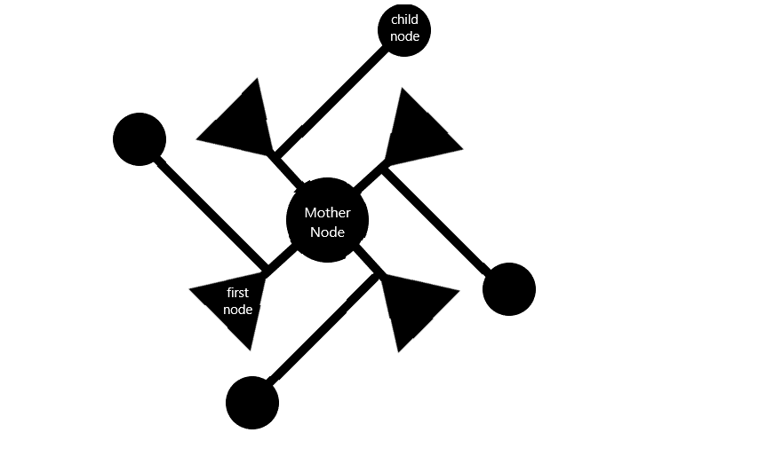

# Harris Coin: A Transparent Centralized Electronic Cash System
## Abstract:
This electronic cash will try to solve governmental issues towards crypto currency as they cannot be regulated or accounted for, while still maintaining the blockchain’s open ledger and a level of anonymity. Most attributes of cyptocurrency are maintained except the network is partially centralized, such that, the “mother node” with power to distribute the coin from her reserves is control by a centralized body unlike other crypto currencies which can be mined to put the coin in circulation. Like bitcoin, the network processes signed transaction by hashing them into an ongoing chain of hash-based proof-of-work, forming a record that cannot be changed without redoing the proof-of-work. Nodes can leave and rejoin the network at will, accepting the Mothers node Proof-of-work chain as proof of what happened while they were away.
## Introduction:
Harris Coin is a transparent digital currency based on blockchain technology in which everyone in the network has access to the blockchain and all its data. It is a network of three (3) different types of nodes namely: 
* Mother Node
* Parent Node
* Child Node.

All can communicate independently and through the mother node which is maintained by a central authority. The mother node is able to broadcast messages to all nodes as well as to release the coins from her reserves into circulation.                                                                                                                            

